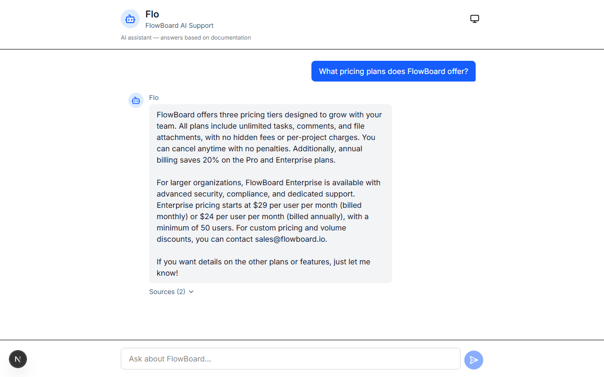
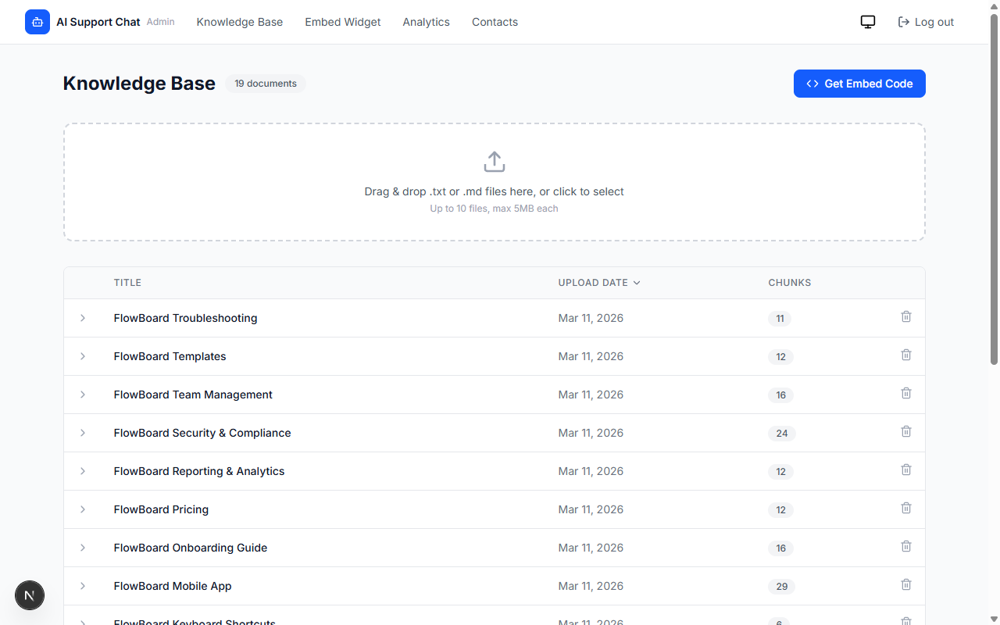
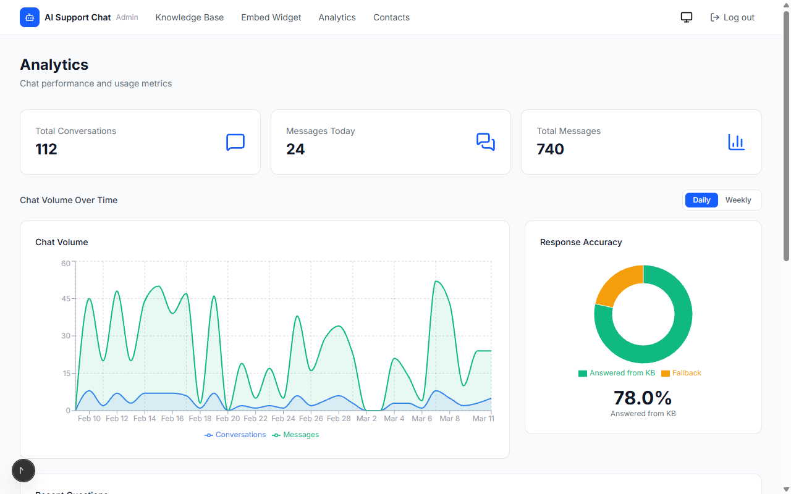
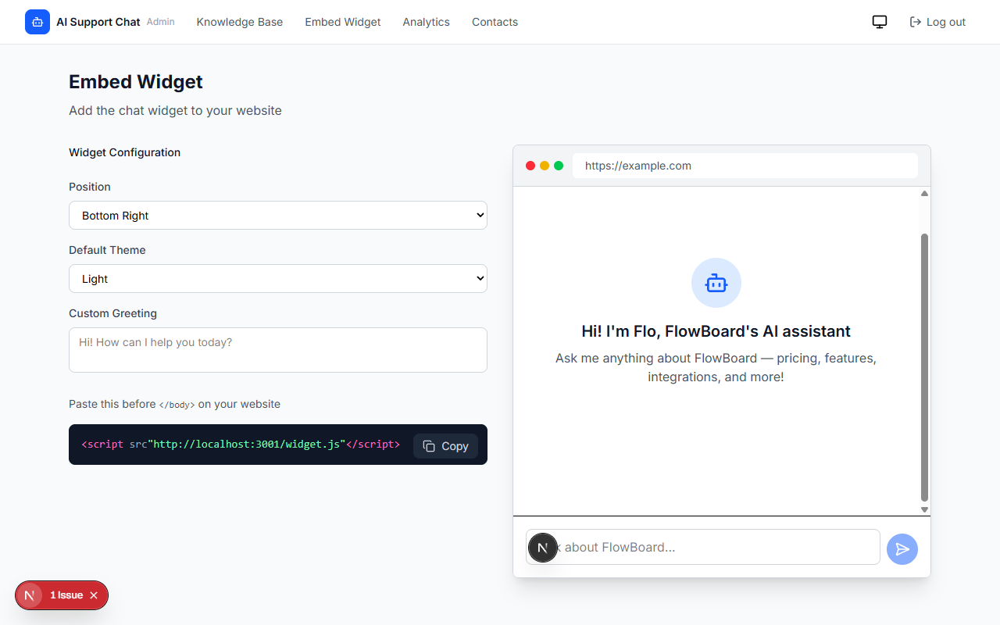

# AI Support Chat

An AI-powered customer support chatbot with RAG (Retrieval-Augmented Generation), an embeddable widget, admin panel, and analytics dashboard.

[Live Demo](https://upwork-ai-chatbot.vercel.app) | [Try the Widget](https://upwork-ai-chatbot.vercel.app/widget)

## Screenshots

### Chat Interface

AI assistant answering questions from the knowledge base with source citations.



### Admin Panel

Knowledge base management with 19 uploaded documents, chunk counts, and drag-and-drop upload.



### Analytics Dashboard

Chat volume trends, response accuracy metrics, and real-time usage statistics.



### Embeddable Widget

Widget configuration page with live preview showing the chat bubble embedded on any website.



## Features

- **AI Chat with RAG** — answers grounded in your knowledge base, reducing hallucination risk
- **Streaming responses** — real-time token-by-token output via Server-Sent Events
- **Embeddable widget** — drop-in `<script>` tag for any website (Intercom-style floating bubble)
- **Admin panel** — upload and manage knowledge base documents, view contacts
- **Analytics dashboard** — chat volume, response accuracy, cost tracking with charts
- **Contact handoff** — when the bot can't answer, it collects user info for follow-up
- **Conversation history** — persisted in Postgres, linked across messages
- **Rate limiting** — per-IP hourly and daily limits via Upstash Redis
- **Cost controls** — daily budget with alerts, automatic shutoff at threshold
- **Dark mode** — full theme support across all pages
- **Sandbox mode** — let prospects upload their own docs to test the bot

## Tech Stack

| Layer | Technology |
|---|---|
| Framework | Next.js 15 (App Router, TypeScript) |
| AI | OpenAI GPT-4.1-mini, text-embedding-3-small |
| RAG | pgvector similarity search on Neon Postgres |
| Database | Neon Postgres (serverless, EU region) |
| Rate Limiting | Upstash Redis |
| Styling | Tailwind CSS v4 |
| Animations | Motion (Framer Motion) |
| Charts | Recharts |
| Auth | iron-session (cookie-based) |
| Linting | Biome |
| Deployment | Vercel |

## Quick Start

```bash
# Clone the repo
git clone https://github.com/voyagi/upwork-ai-chatbot.git
cd upwork-ai-chatbot

# Install dependencies
npm install

# Set up environment variables
cp .env.example .env.local
# Fill in your API keys in .env.local

# Run database migrations (apply schema to your Neon database)
# Import backup/neon-schema.sql into your Neon project

# Seed demo data
npm run seed

# Start the dev server
npm run dev
```

### Environment Variables

| Variable | Description |
|---|---|
| `OPENAI_API_KEY` | OpenAI API key |
| `DATABASE_URL` | Neon Postgres connection string |
| `ADMIN_PASSWORD` | Password for the admin panel |
| `SESSION_SECRET` | 32+ character secret for iron-session |
| `NEXT_PUBLIC_APP_URL` | Public URL of the app |
| `UPSTASH_REDIS_REST_URL` | Upstash Redis URL (for rate limiting) |
| `UPSTASH_REDIS_REST_TOKEN` | Upstash Redis token |

See [.env.example](.env.example) for the full list.

## Architecture

```text
User sends message
  -> Embed question (text-embedding-3-small)
  -> pgvector similarity search (top 5 chunks)
  -> If confident match: stream LLM response with RAG context
  -> If no match: show contact form for human handoff
```

**Key directories:**

```text
src/
  app/           — Next.js pages and API routes
  components/    — React components (chat, admin, widget, ui)
  lib/           — Business logic (RAG, embeddings, cost tracking, auth)
  hooks/         — Custom React hooks
```

## Available Scripts

```bash
npm run dev            # Start dev server (Turbopack)
npm run build          # Production build (widget + Next.js)
npm run check          # Biome lint + format
npm run seed           # Seed demo knowledge base
npm run seed:analytics # Seed sample analytics data
npm run test           # Run tests (Vitest)
```

## Embedding the Widget

Add this script tag to any website:

```html
<script
  src="https://upwork-ai-chatbot.vercel.app/widget.js"
  data-chat-url="https://upwork-ai-chatbot.vercel.app/widget"
  async
></script>
```

A floating chat bubble will appear in the bottom-right corner.

## License

MIT
